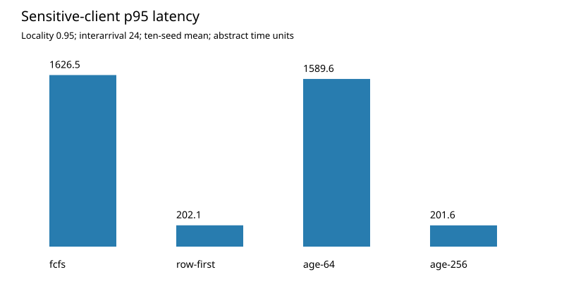

# Age-Bounded Memory Scheduling

A reproducible event-driven experiment on the interaction between row locality, request aging, offered load, and tail latency. This is a simplified single-bank memory model, not a DRAM protocol or CPU simulator.

## Reproduce

Python 3.10 or newer, standard library only; validated with Python 3.12.14. From this directory:

```bash
python3 reproduce.py
```

The command runs seven correctness tests and regenerates all results. Generated result files are overwritten. No external workload, package, device, or network access is required.

## Deliverables

- `reproduce.py`: scheduler implementation, workload generator, tests, sweep, and figure.
- `REPORT.md`: method, measured results, negative findings, limitations, and thesis extension.
- `results/raw.csv`: all 240 configuration/seed outcomes.
- `results/summary.json`: experiment settings, execution environment, and summary statistics.
- `results/MEASUREMENTS.md`: machine-generated comparison table.
- `results/example_trace.csv` and `results/example_schedules.csv`: replayable example arrivals and observed decisions.
- `results/tail_latency.svg`: standalone figure.



The main negative result is that a strict aging threshold can destroy useful row batching and inflate queueing delay. Time values are abstract model units and must not be interpreted as measured nanoseconds.
