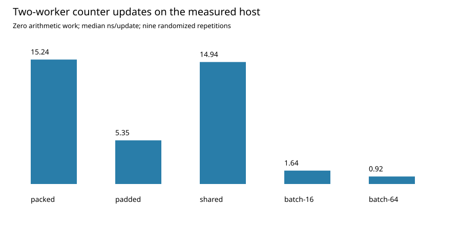

# Bounded-Lag Counter Updates

A complete Linux/x86-64 hardware microbenchmark of false sharing, padding, true sharing, and bounded local batching. It implements an actual counter-update mechanism and measures its tradeoff against a strong padded-counter baseline. This artifact does not claim a novel algorithm.

## Reproduction

Requirements: Linux/x86-64, Python 3.10+, GCC with C11 atomics and pthreads, binutils `objdump`, and at least three allowed logical CPUs. The measured toolchain and flags are recorded in `results/summary.json`; no Python packages are needed.

From this directory:

```bash
python3 reproduce.py && python3 verify_results.py
```

The first command compiles the benchmark, runs 15 independent count/checksum/layout cases, separates pilot runs from evaluation, collects 270 randomized measurements and 45 duration checks, and regenerates reports and a figure. The second validates the generated artifacts. Generated files are overwritten. Wall-clock values will differ between hosts and executions.

## Policies and semantics

- Packed: independent per-thread counters adjacent in one cache line; publish every increment.
- Padded: one counter per 64-byte line; publish every increment.
- Shared: one genuinely shared counter; publish every increment.
- Batch 16/64: packed counters plus a private accumulator; publish a batch and flush the tail before completion.

Batching preserves exact counts after workers finish, but changes intermediate visibility. It must not replace counters requiring per-event immediate publication or a linearizable aggregate. It bounds the algorithm's local buffer by the batch size, not elapsed staleness.

## Artifacts

- `bench.c`: affinity-pinned C11 benchmark with monotonic wall and worker CPU clocks.
- `reproduce.py`: compiler invocation, correctness reference, randomized experiments, bootstrap analysis, and figure.
- `verify_results.py`: independent arithmetic and artifact validation.
- `REPORT.md`: measured findings, primary literature, causal limits, and thesis extension.
- `results/raw.csv`, `convergence.csv`, and `pilot.json`: all retained and pilot measurements.
- `results/summary.json`: environment, source hash, GCC flags, CPU quota, and statistics.
- `results/validation.json` and `assembly_evidence.txt`: checks and observed locked instructions.
- `results/MEASUREMENTS.md` and `comparison.svg`: result table and standalone chart.



Results are actual timings from a shared cloud host, not synthetic latency-model outputs. They remain microbenchmark evidence and do not establish application-level speedup.
