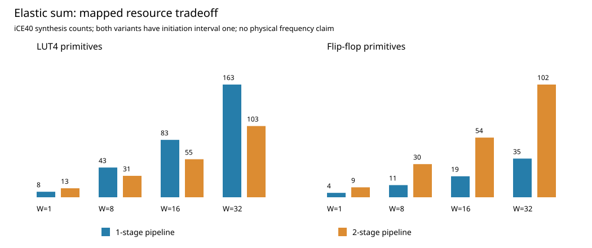

# Elastic Streaming Reduction

A synthesizable SystemVerilog four-operand unsigned reduction datapath with a matched one-stage/two-stage comparison. The project completes RTL simulation, synthesis, generic-netlist simulation, bounded formal checking, and cycle/resource analysis.

## Reproduce

On compatible Linux x86-64 with Python 3.10+, venv support and dpkg-deb:

```bash
python3 run_project.py
```

The first run downloads pinned workspace-local Icarus and YoWASP-Yosys dependencies and verifies the Icarus package SHA-256. The Debian package requires compatible system libraries. Alternatively supply IVERILOG, VVP, YOSYS and, for an extracted Icarus installation, IVL_BASE. No root installation is performed. Tool versions, Yosys revision and source hashes are recorded in the result manifest.

The command builds stimulus/reference files, executes 72 RTL and 24 generic-netlist runs, synthesizes eight configurations through both generic and iCE40 flows, detects an intentional corruption, checks two bounded formal configurations, and validates saved artifacts. Results are regenerated and overwritten.

## Deliverables

- [SPEC.md](SPEC.md): arithmetic, interface, reset, parameter, and performance contract.
- `rtl/stream_sum.sv`: synthesizable elastic datapath.
- `tb/tb.sv`: executed SystemVerilog driver, monitor, queue scoreboard, assertions and coverage counters.
- `formal/properties.sv`: occupancy, valid-state and stalled-output properties.
- `reproduce.py`, `run_project.py`, `verify_results.py`: reproduction and independent result validation.
- `tools/`: pinned dependency list and workspace bootstrap.
- `results/simulation.csv`, `simulation.log`: measured cycles and test evidence.
- `results/resources.json`, `synthesis.log`, `synthesis_commands.ys`: actual mapped resource statistics and synthesis evidence.
- `results/generic_netlists.json`: exact text of the eight generic netlists used in simulation.
- `results/formal.log`, `formal_commands.ys`: bounded proofs and reachable stalled-state witnesses.
- `results/mutation.log`: evidence that the scoreboard rejects a wrong result.
- `results/wave.vcd`: waveform with randomized backpressure and reset.
- [REPORT.md](REPORT.md): findings, engineering implications, literature and limitations.
- `results/comparison.csv`, `MEASUREMENTS.md`, `comparison.svg`: independently extracted cycle/resource comparisons.



This harness is SystemVerilog verification, not UVM. iCE40 synthesis establishes primitive counts; there is no placement/routing, Fmax, power, or FPGA-board claim.
