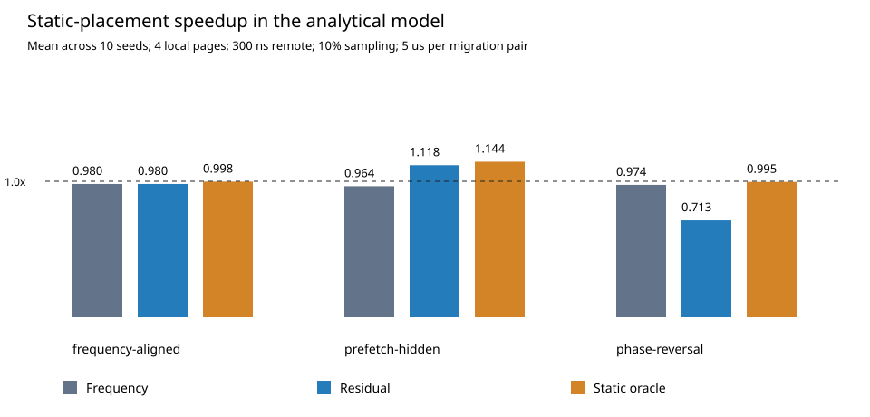

# Prefetch-Aware Page Placement

A complete reproducible analytical experiment investigating whether residual demand wait is a better page-placement signal than access frequency. The artifact includes an executable model, six correctness tests, held-out synthetic workloads, parameter sweeps, raw measurements, a figure, and an analysis report.

## Reproduce

Python 3.10 or newer, standard library only; validated with Python 3.12.14. From this directory:

```bash
python3 -m unittest -v && python3 experiment.py
```

The experiment regenerates `results/raw.csv`, `results/summary.json`, and `results/comparison.svg`. No downloads or privileged hardware are required. Running it overwrites those generated files. The run takes seconds on the validation environment, but execution time is not a scientific result.

## Contents

- `experiment.py`: workload generation, sampled policies, static oracle, sweep, and figure generation.
- `test_experiment.py`: correctness and invariant checks.
- `REPORT.md`: measured outcomes, methodological limits, and thesis extensions.
- `PROPOSAL.md`: architectural research direction beyond this implemented model.
- `results/raw.csv`: every policy/configuration/seed outcome.
- `results/summary.json`: configuration, environment, and predefined summary slice.
- `results/comparison.svg`: standalone visualization.

## Main finding

In the predefined prefetch-hidden slice, sampled residual placement obtains a mean 1.118x modeled speedup over fixed placement; frequency placement obtains 0.964x. However, after a phase reversal, residual placement falls to 0.713x. These are analytical-model measurements, not CPU runtime measurements or CXL hardware results.



See [the report](REPORT.md) for the assumptions that create these outcomes and the limits of generalization. The static service-cost oracle excludes migration when choosing pages and is not an upper bound on total performance.
