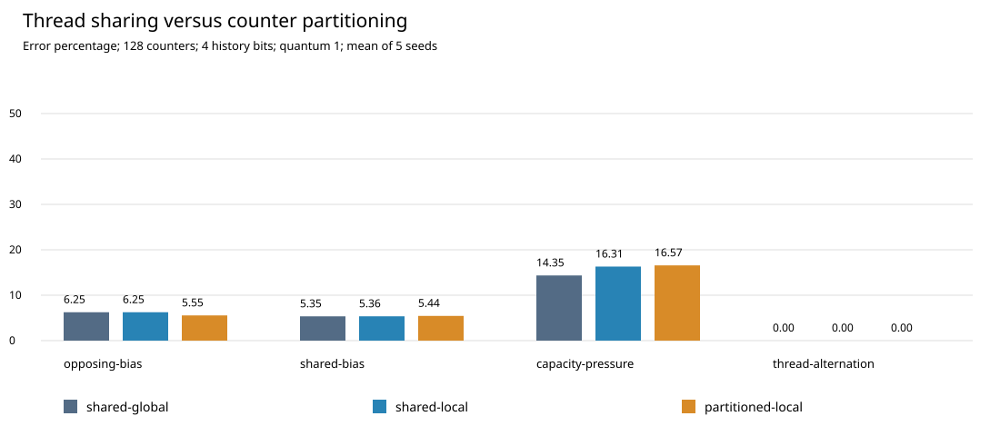

# Thread-Aware Branch Prediction

A reproducible committed-branch trace experiment on destructive interference and capacity loss in shared branch predictors. All policies use the same number of two-bit counters.

## Reproduce

Python 3.10 or newer, standard library only. From this directory:

```bash
python3 reproduce.py
```

This runs seven correctness tests, then regenerates the complete sweep, environment manifest, measurement table, and standalone SVG. Generated files in `results/` are overwritten.

## Artifacts

- `experiment.py`: synthetic traces and three predictor organizations.
- `test_predictor.py`: meaningful invariants and an exact interference counterexample.
- `reproduce.py`: one-command tests and experiments.
- `REPORT.md`: methods, interpretation, limitations, and thesis extension.
- `results/raw.csv`: all configuration/seed measurements and per-thread error counts.
- `results/summary.json`: parameters, environment, and slice statistics.
- `results/MEASUREMENTS.md`: generated comparison table.
- `results/comparison.svg`: standalone figure.



Read [the measured results](results/MEASUREMENTS.md) and [the report](REPORT.md). These are synthetic trace-model results, not application speedups or measurements from a physical processor.
